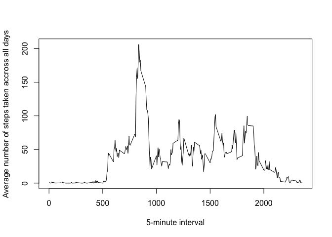

# Reproducible Research: Peer Assessment 1


## Loading and preprocessing the data
1. Load the data

```r
unzip("activity.zip")
activity <- read.csv("activity.csv", na.strings = 'NA')
```
## What is mean total number of steps taken per day?
- Aggregate steps by date

```r
sum_by_date <- aggregate(activity$steps, by= list(activity$date), FUN = sum)
names(sum_by_date) <- c("Date","Steps")
sum_by_date
```

```
##          Date Steps
## 1  2012-10-01    NA
## 2  2012-10-02   126
## 3  2012-10-03 11352
## 4  2012-10-04 12116
## 5  2012-10-05 13294
## 6  2012-10-06 15420
## 7  2012-10-07 11015
## 8  2012-10-08    NA
## 9  2012-10-09 12811
## 10 2012-10-10  9900
## 11 2012-10-11 10304
## 12 2012-10-12 17382
## 13 2012-10-13 12426
## 14 2012-10-14 15098
## 15 2012-10-15 10139
## 16 2012-10-16 15084
## 17 2012-10-17 13452
## 18 2012-10-18 10056
## 19 2012-10-19 11829
## 20 2012-10-20 10395
## 21 2012-10-21  8821
## 22 2012-10-22 13460
## 23 2012-10-23  8918
## 24 2012-10-24  8355
## 25 2012-10-25  2492
## 26 2012-10-26  6778
## 27 2012-10-27 10119
## 28 2012-10-28 11458
## 29 2012-10-29  5018
## 30 2012-10-30  9819
## 31 2012-10-31 15414
## 32 2012-11-01    NA
## 33 2012-11-02 10600
## 34 2012-11-03 10571
## 35 2012-11-04    NA
## 36 2012-11-05 10439
## 37 2012-11-06  8334
## 38 2012-11-07 12883
## 39 2012-11-08  3219
## 40 2012-11-09    NA
## 41 2012-11-10    NA
## 42 2012-11-11 12608
## 43 2012-11-12 10765
## 44 2012-11-13  7336
## 45 2012-11-14    NA
## 46 2012-11-15    41
## 47 2012-11-16  5441
## 48 2012-11-17 14339
## 49 2012-11-18 15110
## 50 2012-11-19  8841
## 51 2012-11-20  4472
## 52 2012-11-21 12787
## 53 2012-11-22 20427
## 54 2012-11-23 21194
## 55 2012-11-24 14478
## 56 2012-11-25 11834
## 57 2012-11-26 11162
## 58 2012-11-27 13646
## 59 2012-11-28 10183
## 60 2012-11-29  7047
## 61 2012-11-30    NA
```

- Histogram of the total number of steps taken each day

```r
hist(sum_by_date$Steps, xlab = "Steps", main = "Histogram of Steps By Date")
```

 

- Mean of the total number of steps taken per day

```r
mean(sum_by_date[!is.na(sum_by_date$Steps),2])
```

```
## [1] 10766.19
```

- Median of the total number of steps taken per day

```r
median(sum_by_date$Steps,na.rm = T)
```

```
## [1] 10765
```

## What is the average daily activity pattern?

```r
avr <- aggregate(activity[!is.na(activity$steps), 1] , by= list(activity[ !is.na(activity$steps), 3]), FUN = mean)
names(avr) <- c("Interval", "Steps")
plot(avr, type = "l", xlab = "5-minute interval", ylab = "Average number of steps taken accross all days")
```

 

- Interval with maximum of steps

```r
avr[ avr$Steps == max(avr$Steps), ]
```

```
##     Interval    Steps
## 104      835 206.1698
```
## Imputing missing values
- Total number of missing values in the dataset 

```r
incompelte <- activity[is.na(activity$steps), ]
length(incompelte$steps)
```

```
## [1] 2304
```

- Create a new dataset that is equal to the original dataset but with the missing data filled in

```r
incompelte$steps <- avr[ avr$Interval %in% incompelte$interval, 2]
new_activity <- activity
new_activity[is.na(new_activity$steps), ] <- avr[ avr$Interval %in% incompelte$interval, 2]
```

```
## Warning in `[<-.factor`(`*tmp*`, iseq, value = c(1.71698113207547,
## 0.339622641509434, : invalid factor level, NA generated
```

- Aggregate steps by date

```r
new_sum_by_date <- aggregate(new_activity$steps, by= list(new_activity$date), FUN = sum)
names(new_sum_by_date) <- c("Date","Steps")
new_sum_by_date
```

```
##          Date Steps
## 1  2012-10-02   126
## 2  2012-10-03 11352
## 3  2012-10-04 12116
## 4  2012-10-05 13294
## 5  2012-10-06 15420
## 6  2012-10-07 11015
## 7  2012-10-09 12811
## 8  2012-10-10  9900
## 9  2012-10-11 10304
## 10 2012-10-12 17382
## 11 2012-10-13 12426
## 12 2012-10-14 15098
## 13 2012-10-15 10139
## 14 2012-10-16 15084
## 15 2012-10-17 13452
## 16 2012-10-18 10056
## 17 2012-10-19 11829
## 18 2012-10-20 10395
## 19 2012-10-21  8821
## 20 2012-10-22 13460
## 21 2012-10-23  8918
## 22 2012-10-24  8355
## 23 2012-10-25  2492
## 24 2012-10-26  6778
## 25 2012-10-27 10119
## 26 2012-10-28 11458
## 27 2012-10-29  5018
## 28 2012-10-30  9819
## 29 2012-10-31 15414
## 30 2012-11-02 10600
## 31 2012-11-03 10571
## 32 2012-11-05 10439
## 33 2012-11-06  8334
## 34 2012-11-07 12883
## 35 2012-11-08  3219
## 36 2012-11-11 12608
## 37 2012-11-12 10765
## 38 2012-11-13  7336
## 39 2012-11-15    41
## 40 2012-11-16  5441
## 41 2012-11-17 14339
## 42 2012-11-18 15110
## 43 2012-11-19  8841
## 44 2012-11-20  4472
## 45 2012-11-21 12787
## 46 2012-11-22 20427
## 47 2012-11-23 21194
## 48 2012-11-24 14478
## 49 2012-11-25 11834
## 50 2012-11-26 11162
## 51 2012-11-27 13646
## 52 2012-11-28 10183
## 53 2012-11-29  7047
```

- Histogram of the total number of steps taken each day

```r
hist(new_sum_by_date$Steps, xlab = "Steps", main = "New Histogram of Steps By Date")
```

 

- Mean of the total number of steps taken per day

```r
mean(new_sum_by_date[!is.na(new_sum_by_date$Steps),2])
```

```
## [1] 10766.19
```

- Median of the total number of steps taken per day

```r
median(new_sum_by_date$Steps,na.rm = T)
```

```
## [1] 10765
```
## Are there differences in activity patterns between weekdays and weekends?


