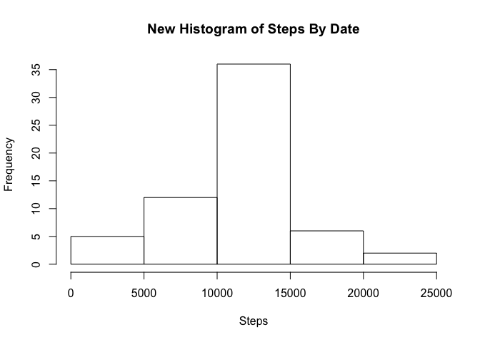

# Reproducible Research: Peer Assessment 1


## Loading and preprocessing the data
1. Load the data

```r
unzip("activity.zip")
activity <- read.csv("activity.csv", na.strings = 'NA')
```
## What is mean total number of steps taken per day?
- Aggregate steps by date. Here is first few rows of result

```r
sum_by_date <- aggregate(activity$steps, by= list(activity$date), FUN = sum)
names(sum_by_date) <- c("Date","Steps")
head(sum_by_date)
```

```
##         Date Steps
## 1 2012-10-01    NA
## 2 2012-10-02   126
## 3 2012-10-03 11352
## 4 2012-10-04 12116
## 5 2012-10-05 13294
## 6 2012-10-06 15420
```

- Histogram of the total number of steps taken each day

```r
hist(sum_by_date$Steps, xlab = "Steps", main = "Histogram of Steps By Date")
```

 

- Mean of the total number of steps taken per day

```r
mean(sum_by_date[!is.na(sum_by_date$Steps),2])
```

```
## [1] 10766.19
```

- Median of the total number of steps taken per day

```r
median(sum_by_date$Steps,na.rm = T)
```

```
## [1] 10765
```

## What is the average daily activity pattern?

```r
avr <- aggregate(activity[!is.na(activity$steps), 1] , by= list(activity[ !is.na(activity$steps), 3]), FUN = mean)
names(avr) <- c("Interval", "Steps")
plot(avr, type = "l", xlab = "5-minute interval", ylab = "Average number of steps taken accross all days")
```

 

- Interval with maximum of steps

```r
avr[ avr$Steps == max(avr$Steps), ]
```

```
##     Interval    Steps
## 104      835 206.1698
```
## Imputing missing values
- Total number of missing values in the dataset 

```r
incompelte <- activity[is.na(activity$steps), ]
length(incompelte$steps)
```

```
## [1] 2304
```

- Create a new dataset that is equal to the original dataset but with the missing data filled in with average steps of that interval.

```r
incompelte$steps <- avr[ avr$Interval %in% incompelte$interval, 2]
new_activity <- activity
new_activity[is.na(new_activity$steps), 1] <- avr[ avr$Interval %in% incompelte$interval, 2]
```

- Aggregate steps by date

```r
new_sum_by_date <- aggregate(new_activity$steps, by= list(new_activity$date), FUN = sum)
names(new_sum_by_date) <- c("Date","Steps")
new_sum_by_date
```

```
##          Date    Steps
## 1  2012-10-01 10766.19
## 2  2012-10-02   126.00
## 3  2012-10-03 11352.00
## 4  2012-10-04 12116.00
## 5  2012-10-05 13294.00
## 6  2012-10-06 15420.00
## 7  2012-10-07 11015.00
## 8  2012-10-08 10766.19
## 9  2012-10-09 12811.00
## 10 2012-10-10  9900.00
## 11 2012-10-11 10304.00
## 12 2012-10-12 17382.00
## 13 2012-10-13 12426.00
## 14 2012-10-14 15098.00
## 15 2012-10-15 10139.00
## 16 2012-10-16 15084.00
## 17 2012-10-17 13452.00
## 18 2012-10-18 10056.00
## 19 2012-10-19 11829.00
## 20 2012-10-20 10395.00
## 21 2012-10-21  8821.00
## 22 2012-10-22 13460.00
## 23 2012-10-23  8918.00
## 24 2012-10-24  8355.00
## 25 2012-10-25  2492.00
## 26 2012-10-26  6778.00
## 27 2012-10-27 10119.00
## 28 2012-10-28 11458.00
## 29 2012-10-29  5018.00
## 30 2012-10-30  9819.00
## 31 2012-10-31 15414.00
## 32 2012-11-01 10766.19
## 33 2012-11-02 10600.00
## 34 2012-11-03 10571.00
## 35 2012-11-04 10766.19
## 36 2012-11-05 10439.00
## 37 2012-11-06  8334.00
## 38 2012-11-07 12883.00
## 39 2012-11-08  3219.00
## 40 2012-11-09 10766.19
## 41 2012-11-10 10766.19
## 42 2012-11-11 12608.00
## 43 2012-11-12 10765.00
## 44 2012-11-13  7336.00
## 45 2012-11-14 10766.19
## 46 2012-11-15    41.00
## 47 2012-11-16  5441.00
## 48 2012-11-17 14339.00
## 49 2012-11-18 15110.00
## 50 2012-11-19  8841.00
## 51 2012-11-20  4472.00
## 52 2012-11-21 12787.00
## 53 2012-11-22 20427.00
## 54 2012-11-23 21194.00
## 55 2012-11-24 14478.00
## 56 2012-11-25 11834.00
## 57 2012-11-26 11162.00
## 58 2012-11-27 13646.00
## 59 2012-11-28 10183.00
## 60 2012-11-29  7047.00
## 61 2012-11-30 10766.19
```

- Histogram of the total number of steps taken each day

```r
hist(new_sum_by_date$Steps, xlab = "Steps", main = "New Histogram of Steps By Date")
```

 

- Mean of the total number of steps taken per day

```r
mean(new_sum_by_date[!is.na(new_sum_by_date$Steps),2])
```

```
## [1] 10766.19
```

- Median of the total number of steps taken per day

```r
median(new_sum_by_date$Steps,na.rm = T)
```

```
## [1] 10766.19
```
## Are there differences in activity patterns between weekdays and weekends?

- Aggregate steps by date

```r
Sys.setlocale("LC_TIME", "C")
```

```
## [1] "C"
```

```r
isweekend_sum_by_date <- new_activity
isweekend_sum_by_date$weekdays <- as.factor(weekdays(as.POSIXct(new_activity$date)));
isweekend_sum_by_date$isWeekend <- as.factor(ifelse(isweekend_sum_by_date$weekdays %in% c("Saturday","Sunday"), "weekend","weekday"));
isweekend_sum_by_date <- aggregate(new_activity$steps, by= list(new_activity$interval, isweekend_sum_by_date$isWeekend), FUN = mean)
names(isweekend_sum_by_date) <- c("Interval","isWeekday","Steps")

head(isweekend_sum_by_date)
```

```
##   Interval isWeekday      Steps
## 1        0   weekday 2.25115304
## 2        5   weekday 0.44528302
## 3       10   weekday 0.17316562
## 4       15   weekday 0.19790356
## 5       20   weekday 0.09895178
## 6       25   weekday 1.59035639
```

- Histogram of the total number of steps taken each day

```r
# install.packages("ggplot2")

library(ggplot2)
g <- ggplot(isweekend_sum_by_date,  aes( x = Interval, y = Steps)) 
g  + geom_line( aes(group = isWeekday) ) + facet_grid( isWeekday ~ .) + scale_x_discrete( breaks = seq(from = 0, to= max(isweekend_sum_by_date$Interval), by = 250))
```

 


